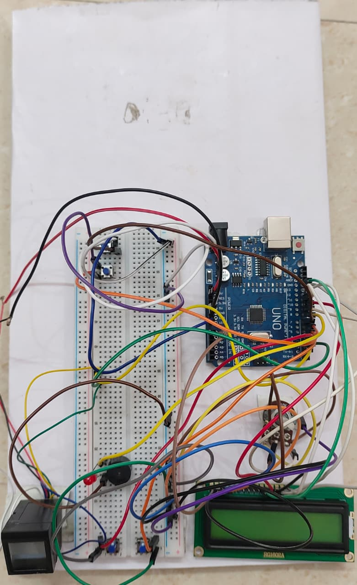

# Anti-Theft Voting Machine

## 📖 Overview
The Anti-Theft Voting Machine is an embedded-system-based secure voting solution designed using the ATmega328P microcontroller and fingerprint authentication technology. The system enhances voting security by allowing only authorized users to vote while also providing anti-theft protection features to prevent unauthorized access and tampering.

This project demonstrates the practical implementation of embedded systems, biometric authentication, and secure electronic voting mechanisms.

---

## 🚀 Features
- Fingerprint-based voter authentication
- Secure electronic voting process
- Anti-theft protection mechanism
- EEPROM-based vote storage
- User-friendly voting interface
- Unauthorized access detection

---

## 🛠 Components Used
- ATmega328P Microcontroller
- R307 Fingerprint Sensor
- LCD Display
- Push Buttons
- Buzzer
- LEDs
- Power Supply Module

---

## 💻 Software & Tools
- Arduino IDE
- Embedded C
- Arduino Programming

---

## ⚙️ Working Principle
1. The system initializes all connected modules.
2. User fingerprint is scanned using the R307 fingerprint module.
3. The fingerprint is verified with stored authorized data.
4. If authentication is successful, the user is allowed to cast a vote.
5. Votes are securely stored using EEPROM memory.
6. If unauthorized access or tampering is detected, the anti-theft mechanism activates an alert through the buzzer.

---

## 📂 Project Structure

```text
code/
   authentication_process.ino
   voting_process.ino

images/
   project_setup.jpg
```

---

## 🔐 Authentication Module
The authentication module is responsible for:
- Fingerprint enrollment
- Fingerprint matching
- Authorized voter verification
- Access control for secure voting

---

## 🗳 Voting Module
The voting module handles:
- Candidate selection
- Vote casting
- Vote counting
- EEPROM vote storage

---

## 📷 Project Images

### Hardware Setup


---

## 🔮 Future Improvements
- IoT-based remote monitoring
- GSM alert system
- Cloud-based vote storage
- Mobile application integration

---

## 🎯 Applications
- College Elections
- Small Organization Voting
- Secure Polling Systems

---

## 👨‍💻 Author
Ritesh Salunke

Electronics & Telecommunication Engineering Student  
Interested in Embedded Systems, IoT, and Industrial Automation
